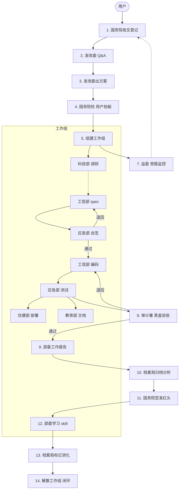

# "为人民服务！"系统

> 13 个 Agent 参照现代国家机关架构各司其职：发改委把需求问到透，应急部会签不让乱写，审计署 cos 用户黑盒验收，档案局用九维索引让上次踩的坑这次不踩。
> 
> 14 步流水线从收文到闭环：**说清楚才做 → 做完了有人验 → 踩坑了有记录 → 下次自动防。**
> 
> 不是什么"Agent 自由对话"。是对每一行代码负责。

---

## 你说了算还是 AI 说了算？

普通 Multi-Agent 是这样的：

```
用户：写个后台管理系统

Agent：好的！（直接开写）
       （3 小时后）
Agent：搞完了。顺便把数据库也重构了，
       认证换成了 oauth2，
       前端改成了 react 19...
用户：？？？
```

"为人民服务！"系统是这样的：

```
用户：写个后台管理系统

国务院Agent：收到。转发发改委评估。
发改委Agent：先别急。系统给谁用的？
        要支持多少并发？
        已有的技术栈是什么？
国务院Agent：发改委Agent问你是给谁用的？支持多少并发？已有什么技术栈？
用户：哦对，给运营团队，200 人，已有的 vue3 + go。

国务院Agent → 发改委Agent：清楚了吗？
发改委Agent：清楚了。方案：工信部写 spec → 应急部会签 →
        编码 → 应急部测试 → 住建部部署 →
        教育部写文档。5 个部委并行，预计 2 天。
国务院Agent→ 用户：方案：....。这样可行吗？
用户：行。
国务院Agent：批准。工作组组建，开始执行。
        (2 天后)
审计署Agent：验收完毕。所有端点功能正常，
        README 安装流程跑通，异常输入不崩溃。
        合格 ✅

// —— 一般的 AI 到这里就结束了 ——
// 为人民服务还有后半段：


国务院Agent：工作组内各部委总结工作报告，开展自我批评。

工信部Agent：工作报告已提交。spec 会签阶段被退回 2 次，
        第 3 轮才通过。根因：OpenAPI 错误码定义
        不完整。教训：以后先对照国发5号自审再提交。
        自我批评：低级错误，自审清单加一项。

应急部Agent：测试发现边界条件漏了空数组处理。
        建议工信部自审清单加"空输入验证"。

国务院Agent：收到全部报告。转发档案局归档。
档案局Agent：归档完毕。九维索引重建。
        交叉分析发现：
        - "低级错误"累计 4 次 → 建议发红头
        - "spec 会签"阶段 3 次卡顿 → 建议调整编制
        《关于若干问题》草案已生成。

国务院Agent：草案审阅完毕。签发红头：
        国发〔2026〕7号
        《关于加强 spec 自审工作的通知》
        → 存档 + 群发各部委学习。

工信部Agent：收到。学习国发〔2026〕7号。
        提炼 skill：spec-self-review
        （提交 spec 前逐项对照自审清单）。
        消化完毕 ✅。

应急部Agent：学习完毕。skill：empty-input-validation ✅
教育部Agent：学习备案。本次不涉及 ✅

档案局Agent：国发〔2026〕7号 全部部委已消化。
国务院Agent：解散工作组。闭环 ✅。

// 下次有人提类似需求——
// skill 自动加载，上次踩的坑不会再踩。
```

**区别**：不猜。问清楚再动手。做完有人验收。踩坑了记下来下次不踩。

---

## 流程总览



---

## 13 个 Agent 各司其职

### 谁说了算

| Agent | 职责 | 不能干什么 |
|-------|------|-----------|
| **guowuyuan** 国务院 | 收文 / Q&A 中转 / 建组 / 呈报 / 签发红头 | 不做技术分析 |
| **fagaiwei** 发改委 | 需求澄清 → 拆 phase → 出方案 → 建议编制 | 不执行、不写码 |
| **jianwei** 国家监委 | 心跳监控 / 停滞检测 / 合规 / 返工追踪 | 不阻塞、不叫停 |
| **shenjishu** 审计署 | cos 普通用户黑盒验收，≤3 轮退回 | 不读代码 |
| **danganju** 档案局 | 归档 / 九维索引 / 交叉分析 / 消化追踪 | 不做决定 |

### 谁干活

| Agent | 职责 | 能调谁 |
|-------|------|--------|
| **kejibu** 科技部 | 并行调研，方案对比 | 参事室 / 信息中心 / 分析办 |
| **gongxinbu** 工信部 | spec → 编码 → 自审 | 参事室 / 信息中心 / 分析办 |
| **yingjibu** 应急管理部 | 会签 / 测试 / CVE 扫描 | 参事室 / 信息中心 / 分析办 |
| **zhujianbu** 住建部 | Dockerfile / CI/CD / 部署 | 参事室 / 信息中心 / 分析办 |
| **jiaoyubu** 教育部 | API 文档 / README / 架构说明 | 参事室 / 信息中心 / 分析办 |

### 谁查资料

| Agent | 干什么 |
|-------|--------|
| **canshishi** 参事室 | 深度技术分析，只读不写 |
| **xinxizhongxin** 信息中心 | 外部文档 / GitHub / Context7 |
| **fenxiban** 分析办 | 代码库搜索 grep/glob/lsp/ast-grep |

---

## 14 步走完一个任务

| 步 | 谁 | 干什么 |
|----|-----|------|
| 1 | 国务院 | 登记 TASK-YYYYMMDD-NNN，转发发改委 |
| 2 | 发改委→国务院→用户 | 需求 Q&A（≤5 轮，问不清就标注"基于假设"继续）|
| 3 | 发改委 | 查档案 → 拆 phase → 出方案 → 建议编制 |
| 4 | 国务院→用户 | 方案展示 → 用户说"可以"或"搞" |
| 5 | 国务院 | `stp_workgroup_create` 组建工作组 + spawn 监委 |
| 6 | 工作组 | 工信部 spec → 应急部会签 → 编码 → 住建部部署 → 教育部文档 |
| 7 | 监委 | 后台盯心跳/停滞/返工，异常写报告给国务院 |
| 8 | 审计署 | cos 普通用户验收：装 README → 跑功能 → 测边界 |
| 9 | 部委→国务院 | 写工作报告 + 自我批评（踩了什么坑、什么教训）|
| 10 | 档案局 | 收报告 → 九维索引 → 交叉分析 → 《若干问题》草案 |
| 11 | 国务院 | 读草案 → 签发红头 → 归档 + 群发部委 |
| 12 | 部委 | 学习红头 → 提炼 skill → `stp_skill_write` 落盘 |
| 13 | 档案局 | `stp_danganju_digestion` 标记消化 |
| 14 | 国务院 | `stp_workgroup_disband` 解散工作组。下次任务 skill 自动加载 |

---

## 几条红线

- spec 未经会签 → **禁止编码**
- Q&A ≤ 5 轮 · 退回 ≤ 3 轮 · 审计 ≤ 3 轮
- 国务院不做技术分析。监委不阻塞。审计不读代码。
- 按需部委只能 spawn `fenxiban / xinxizhongxin / canshishi`

---

## 安装

```bash
git clone https://github.com/bomomoQWQ/Serve-the-People.git
cd Serve-the-People && bash install.sh
```

手动：`bun install && bun run build`，OpenCode 配置加 `{ "plugin": ["/path/to/Serve-the-People"] }`。重启即用。

---

## 存储

```
~/.servethepeople/          ← 全局持久（跨项目）
├── skills/                 SKILL.md（部委学习产物）
└── archives/
    ├── works/              工作报告 + 自我批评
    ├── indices/index.json  九维索引
    └── digestion.json      消化记录

{project}/.servethepeople/  ← 项目级（临时）
└── teams/                  ← 工作组，解散即删
```

---

## 工具一览

**工作组** `stp_workgroup_create` `stp_workgroup_task` `stp_workgroup_message` `stp_workgroup_disband`

**档案局** `stp_danganju_archive` `stp_danganju_query` `stp_danganju_analyze` `stp_danganju_draft` `stp_danganju_digestion`

**审计署** `stp_shenjishu_audit`

**代码** `stp_lsp_diagnostics` `stp_lsp_symbols` `stp_ast_grep_search` `stp_ast_grep_replace` `stp_edit` `stp_grep` `stp_glob`

**Skill** `stp_skill_write` `stp_skill_list`

**会话** `stp_task` `stp_background_output` `stp_background_cancel`

---

## 模型

默认不设（OpenCode 自选）。推荐：

| Agent | 模型 |
|-------|------|
| `canshishi` `xinxizhongxin` `fenxiban` | claude-sonnet-4-6 |
| `gongxinbu` | gpt-5.5 |
| 其余 | claude-sonnet-4-6 |

覆盖：`.opencode/serve-the-people.jsonc`

---

## 致谢

[oh-my-openagent](https://github.com/code-yeongyu/oh-my-openagent) · [edict 三省六部](https://github.com/cft0808/edict) · [OpenCode](https://opencode.ai)

---

## 许可证

GPL-3.0
