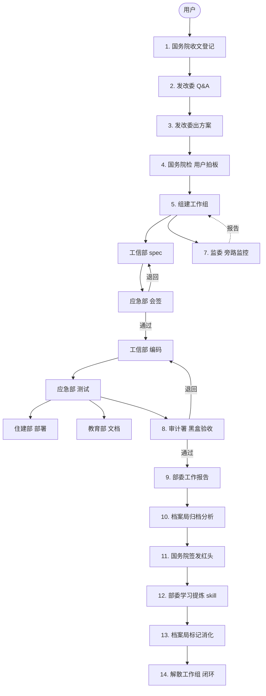

# 为人民服务 · Serve the People

> 13 Agent × 14 步流水线。需求澄清 → 方案会签 → 并行执行 → 独立验收 → 经验归档。

## 流程总览



---

## 为什么不用自由对话

市面多数 Multi-Agent 是 Agent 自己聊完给结果——没需求澄清、没独立验收、没经验积累。**上次翻的错下次继续翻。** 本系统用分权制衡解决：

| 机制 | 对应 Agent |
|------|-----------|
| 动手前先问清楚 | 发改委结构化 Q&A，≤5 轮 |
| 执行有人盯 | 国家监委旁路心跳/停滞/合规 |
| 结果有验收 | 审计署 cos 普通用户黑盒验证 |
| 教训能存 | 档案局九维索引 + 《若干问题》|

---

## 安装

```bash
git clone https://github.com/bomomoQWQ/Serve-the-People.git
cd Serve-the-People && bash install.sh    # Unix
# 或 powershell install.ps1               # Windows
```

手动安装：`bun install && bun run build`，OpenCode 配置加：

```jsonc
{ "plugin": ["/path/to/Serve-the-People"] }
```

重启 OpenCode。配置文件 `.opencode/serve-the-people.jsonc` 自动生成。

---

## Agent

### 常设机构 (primary — 通过 task() 调用)

| Agent | 职责 |
|-------|------|
| **guowuyuan** 国务院 | 收文 / Q&A 中转 / 建组 / 呈报 / 签发红头。不做技术分析。 |
| **fagaiwei** 发改委 | 需求澄清 → 拆 phase → 出方案 → 建议编制。不执行。 |
| **jianwei** 国家监委 | 心跳监控 / 停滞检测 / 合规 / 返工追踪。不阻塞。 |
| **shenjishu** 审计署 | cos 普通用户黑盒验收。≤3 轮退回。不读代码。 |
| **danganju** 档案局 | 归档 / 九维索引 / 交叉分析 / 消化追踪。不做决定。 |

### 按需部委 (subagent — 由国务院 spawn 进工作组)

| Agent | 职责 |
|-------|------|
| **kejibu** 科技部 | 并行调研 (explore + librarian + oracle) |
| **gongxinbu** 工信部 | spec → 编码 → 自审 |
| **yingjibu** 应急管理部 | 会签 / 测试 / CVE 扫描 |
| **zhujianbu** 住建部 | Dockerfile / CI/CD / 部署 |
| **jiaoyubu** 教育部 | API 文档 / README / 架构说明 |

### 基础工具

**oracle** 只读顾问 · **librarian** 外部搜索 · **explore** 代码搜索

---

## 14 步流水线

| 步 | 阶段 | 动作 |
|----|------|------|
| 1 | 收文 | 国务院登记 TASK-ID，转发发改委 |
| 2 | Q&A | 发改委提问 → 国务院去术语 → 用户回答（≤5 轮）|
| 3 | 方案 | 发改委查档案 → 拆 phase → 出方案 + 编制建议 |
| 4 | 拍板 | 国务院完整性检查 → 用户确认 |
| 5 | 建组 | workgroup_create spawn 部委 + 监委旁路 |
| 6 | 执行 | 工信部 spec → 应急部会签 → 编码 → 部署/文档（退回 ≤3 轮）|
| 7 | 监督 | 监委心跳/停滞/返工监控 → 报告国务院 |
| 8 | 验收 | 审计署黑盒验收（≤3 轮退回，第 3 轮已知缺陷放行）|
| 9 | 报告 | 部委写工作报告 + 自我批评 → 国务院中转 |
| 10 | 归档 | 档案局归档 → 九维索引 → 交叉分析 → 《若干问题》草案 |
| 11 | 红头 | 国务院签发红头 → 归档 + 群发部委 |
| 12 | 学习 | 部委学习 → 提炼 skill (skill_write) |
| 13 | 消化 | 档案局标记消化 (danganju_digestion) |
| 14 | 闭环 | workgroup_disband 解散工作组，下次任务自动加载 skill |

---

## 工具

**工作组** `stp_workgroup_create` `stp_workgroup_status` `stp_workgroup_task` `stp_workgroup_message` `stp_workgroup_disband`

**档案局** `stp_danganju_archive` `stp_danganju_query` `stp_danganju_analyze` `stp_danganju_draft` `stp_danganju_digestion`

**审计署** `stp_shenjishu_audit`

**代码分析** `stp_lsp_diagnostics` `stp_lsp_symbols` `stp_ast_grep_search` `stp_ast_grep_replace` `stp_edit` `stp_grep` `stp_glob`

**Skill** `stp_skill_write` `stp_skill_list`

**会话** `stp_task` `stp_background_output` `stp_background_cancel` `stp_session_*`

---

## 存储布局

```
~/.servethepeople/          ← 全局持久（跨项目）
├── skills/                 SKILL.md
└── archives/
    ├── works/              工作报告 + 自我批评
    ├── indices/index.json  九维索引
    └── digestion.json      消化记录

{project}/.servethepeople/  ← 项目级（临时）
└── teams/                  ← 工作组，解散即删
```

---

## 红线

- spec 未经会签 → **禁止编码**
- Q&A ≤ 5 轮 · 退回 ≤ 3 轮 · 审计 ≤ 3 轮
- 国务院不做技术分析 · 监委不阻塞 · 审计不读代码
- 按需部委只能 spawn `explore / librarian / oracle`

---

## 模型

默认不设模型（OpenCode 自选）。推荐：

| Agent | 模型 |
|-------|------|
| `oracle` `librarian` `explore` | claude-sonnet-4-6 |
| `gongxinbu` | gpt-5.5 |
| 其余 | claude-sonnet-4-6 |

配置覆盖：`.opencode/serve-the-people.jsonc`

```jsonc
{ "agents": { "guowuyuan": { "model": "your-provider/model" } } }
```

---

## 项目结构

```
src/
├── agents/       13 Agent factories + registry
├── tools/        grep glob delegate-task workgroup danganju shenjishu
│                 lsp-diagnostics lsp-symbols ast-grep-* hashline-edit skill-*
│                 background-task
├── hooks/        jianwei-monitor workgroup-mailbox-injector workgroup-idle-wake
├── features/     workgroup/ pipeline/ shenjishu/ archives/
├── mcp/          websearch context7 grep_app
└── shared/       paths skill-loader ripgrep-cli
```

---

## 致谢

[oh-my-openagent](https://github.com/code-yeongyu/oh-my-openagent) · [edict 三省六部](https://github.com/cft0808/edict) · [OpenCode](https://opencode.ai)

---

## 许可证

GPL-3.0
